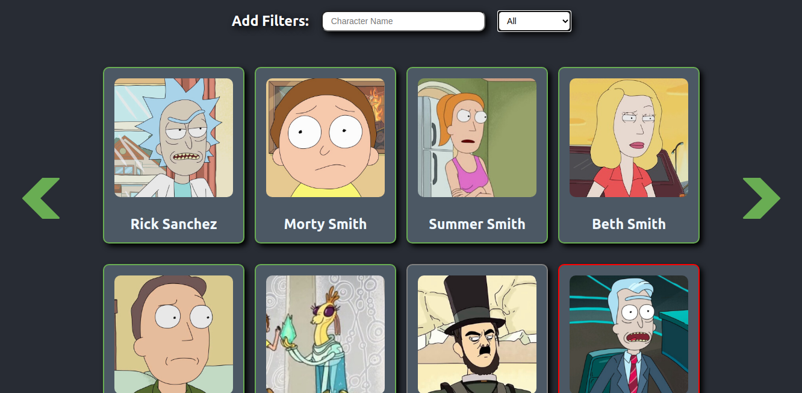
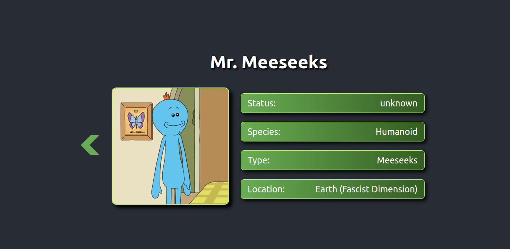

# Rick-and-Morty-Catalog
> This project is a catalog to display details about all the characters on the Rick & Morty TV show. It is not an app to create and add new characters, it's just a browsable list of character that you can filter and access to their details.


> This is the index page, where you can add filters and browse through the different pages of characters.


> This is the details page where you can see the characters info about it's current status, last known location, and species.

---

## Built With

- Javascript ES6
- React
- Redux
- Rick and Morty API
- HTML
- CSS
- VS Code

## Live Demo

> Check this app online on its [Live demo](https://rick-and-morty-catalog.herokuapp.com/)

## How to Install

> You can have a local copy of this project by following these simple steps:

- Install Node in your system. To install Node, you can read the [Documentation](https://nodejs.org/en/download/package-manager/)
- Clone the repo or download the zip file into your machine. 
    ``` 
   git clone https://github.com/Miguelus373/Rick-and-Morty-Catalog.git
    ``` 
- On your terminal, CD into the Rick-and-Morty-Catalog folder and run
    ``` 
   npm install
    ``` 
- This will install all the dependancies.

- Then run 
    ``` 
   npm start
    ``` 
- This will start a local server that you can access with [This Link](http://localhost:3000/) on your browser

## How to Run Tests

> Most of this project's files have their own tests. Follow these steps to run them:

- First you will need a local copy of this project (folow the [How to Install](##How-to-Install) section).

- Once you have this project and its dependecies, CD into the Rick-and-Morty-Catalog folder and run
    ``` 
   npm run test
    ``` 
- This will run the tests and show you the results

---


## Author  

👤 **Miguel Uzcátegui**

- Github: [@miguelus373](https://github.com/miguelus373)
- Linkedin: [Miguel-Uzcátegui](https://www.linkedin.com/in/miguelus/)


## 🤝 Contributing

Contributions, issues and feature requests are welcome!. Feel free to check the [issues page](https://github.com/Miguelus373/Rick-and-Morty-Catalog/issues).

## Show your support

Give a ⭐️ if you like this project!

## Acknowledgments

- This is the Catalogue of Recipes Microverse capstone project

- This project uses the [JS Library](https://github.com/afuh/rick-and-morty-api-node) of the [Rick & Morty API](https://rickandmortyapi.com/) for getting the characters info. You can check the API documentation [here](https://rickandmortyapi.com/documentation)

- Design idea by [Marc-Antoine Roy on Behance](https://www.behance.net/enfantroy)

## 📝 License
This project is [MIT](https://github.com/Miguelus373/Rick-and-Morty-Catalog/blob/develop/LICENSE) licensed.
